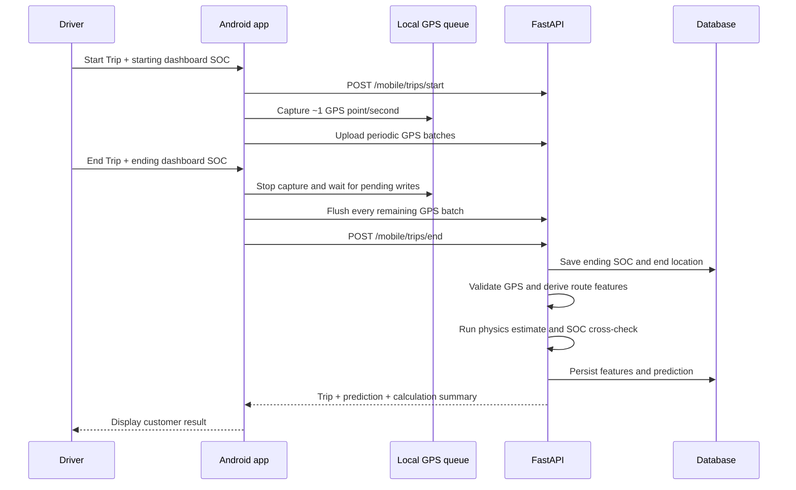

# Trickee Developer Handoff

Last updated: 2026-08-05
Working repository: `gpsdriver` (isolated copy; `trickee_new` is unchanged)
Implementation branch: `feature/gpsdriver-gate0`

## 1. Project purpose

Trickee is a GPS-first EV trip intelligence application. The Android app records
foreground GPS samples during a driver-initiated trip. The FastAPI backend
validates those samples and combines them with vehicle specifications to
estimate route energy, Wh/km, demand score, SOC consumption, and remaining
range when a recent SOC reading is available.

The current product does **not** claim to read BMS data. Starting and ending SOC
are manually entered from the vehicle dashboard. This distinction must remain
visible in the UI, API fields, and documentation.

## 2. Current status

### Android live telemetry Gates 0–4 repository implementation (2026-08-05)

- Google OAuth identity verification is linked to pre-provisioned users, with
  rotating Trickee user refresh-token families and replay revocation.
- Android installations are registered to one active fleet vehicle and use
  separate rotating, revocable device tokens.
- The strict schema-v1 contract records one logical GPS/IMU health window per
  second, including honest missing-GPS windows and actual IMU completeness.
- The v2 ingestion endpoint supports JSON/gzip, 100-window batches, and a
  512 KiB uncompressed limit.
- Receipt, canonical window, contiguous upload cursor, permanent conflict
  rejection, and server outbox changes share one database commit.
- Database uniqueness enforces `sample_id` and
  `(device_id, trip_id, sequence_no)` idempotency. Exact retries are success;
  conflicting reuse is quarantined and never overwrites telemetry.
- A Kotlin location foreground service owns 1 Hz fused GPS and 50 Hz
  accelerometer/gyroscope collection. Each elapsed-second window commits to a
  Room WAL outbox before the serialized gzip uploader may transmit it.
- WorkManager backfill, lease recovery, bounded full-jitter retry, contiguous
  ACKs, Android Keystore device/user sessions, and Credential Manager Google
  sign-in are implemented.
- Offline-first trip start and final-sequence completion are idempotent. A trip
  cannot finalize until its canonical upload cursor reaches the declared end.
- PostgreSQL outbox relay, Redis Streams consumer recovery, independent
  processor idempotency, dead-lettering, live-state/IMU/finalization processors,
  REST/WebSocket recovery, metrics, and verified archive manifests are present.
- `infra/gcp` defines the private HA/PITR Google Cloud topology. Capacity and
  three-day cohort evaluators are executable under `backend/scripts`.

Repository completion does not equal fleet certification. Physical two-phone
trips, company-GCP apply/failover/restore, the full 150-identity capacity run,
and three-day cohort holds remain external evidence. See
`docs/evidence/gates-1-to-4-status.md`.

The repository is ready for a local manager demonstration:

- React Native Android application builds successfully.
- FastAPI backend, SQLite development database, PostgreSQL deployment path, and
  Alembic migration are present.
- Start Trip requires starting dashboard SOC.
- End Trip requires ending dashboard SOC.
- The app stops GPS collection and uploads every queued point before the backend
  closes and calculates the trip.
- The result screen displays GPS distance, SOC change, calculated energy,
  Wh/km, confidence, sample count, and estimated range when available.
- Insufficient or invalid GPS is reported honestly and is never presented as a
  successful zero-distance calculation.
- Driver and fleet-manager demo accounts are seeded.
- The manager dashboard aggregates fleet trips and predictions.
- Android emulator API 36.1 has completed the driver login, start-SOC, GPS
  movement, end-SOC, calculation result, and fleet-manager dashboard flow.
- API timestamps are emitted as UTC (`Z`) so active-trip timers are correct in
  non-UTC device timezones.
- Stale zero-speed GPS readings fall back to coordinate-derived speed, rejected
  segments are excluded from every trip aggregate, and estimated range is
  bounded by the SOC-adjusted certified vehicle range.

Final Gates 0–4 repository verification on 2026-08-05:

- `76` backend tests pass, including identity, trip lifecycle, ingestion,
  stream recovery, realtime/archive and capacity-tool behavior.
- A clean database migrates through `0003_realtime_processing (head)`.
- TypeScript and changed/new-file ESLint pass with zero warnings.
- Docker Compose configuration and GCP HCL/static topology checks pass.
- Android unit tests, instrumentation-test compilation and `assembleDebug`
  pass (`313` tasks, 14m04s). Physical-device instrumentation remains pending.

GitHub Actions is intentionally manual-only in `.github/workflows/ci.yml`.
Automatic jobs could not start because the repository owner's GitHub account
was locked for an Actions billing issue. Re-enable `push` and `pull_request`
triggers after that account issue is cleared.

## 3. Architecture

| Layer | Technology | Responsibility |
|---|---|---|
| Mobile | React Native 0.73 + native Kotlin | UI/auth bridge; location foreground service, Room outbox, uploader and recovery own telemetry |
| API | FastAPI / Pydantic | Human/device auth, idempotent trip lifecycle and telemetry ingestion |
| Data | SQLAlchemy / Alembic | SQLite for development; canonical PostgreSQL plus transactional outbox in production |
| Processing | Redis Streams + Python workers | Recoverable relay, independent idempotent processors and dead-letter flow |
| Realtime | FastAPI REST/WebSocket + Prometheus | Fleet-isolated versioned snapshots and low-cardinality operations telemetry |
| Intelligence | Python physics pipeline | GPS filtering, route features, physics energy estimate, confidence and range |
| Deployment | Docker Compose + Terraform | Local process roles; GCP Cloud Run, Cloud SQL HA/PITR, Memorystore HA and private archive |

Important code locations:

| Area | File |
|---|---|
| App entry | `mobile/App.tsx` |
| Mobile API URL and feature flags | `mobile/src/config/index.ts` |
| API client | `mobile/src/services/api.ts` |
| Native collector and bridge | `mobile/android/app/src/main/java/com/trickeeandroid/telemetry/`, `mobile/src/services/telemetryNative.ts` |
| Trip start/end UI | `mobile/src/components/DriverActionSheet.tsx` |
| SOC input | `mobile/src/components/SOCEntryModal.tsx` |
| Customer calculation result | `mobile/src/components/CalculationOverlay.tsx` |
| Live data and GPS lifecycle | `mobile/src/context/LiveDataContext.tsx` |
| Backend entry | `backend/app/main.py` |
| Trip and GPS endpoints | `backend/app/routers/mobile.py` |
| Owner summary | `backend/app/routers/fleet_owner.py` |
| GPS validation/features | `backend/app/services/gps_feature_pipeline.py` |
| Prediction orchestration | `backend/app/services/gps_prediction_service.py` |
| Physics calculation | `backend/app/services/physics_energy.py` |
| Database models | `backend/app/models/entities.py` |
| Initial migration | `backend/alembic/versions/0001_gps_first.py` |
| Live telemetry migration | `backend/alembic/versions/0002_live_telemetry_foundation.py` |
| Realtime processing migration | `backend/alembic/versions/0003_realtime_processing.py` |
| Telemetry contract | `backend/app/telemetry/contracts.py` |
| Atomic ingestion | `backend/app/telemetry/persistence.py` |
| Telemetry v2 route | `backend/app/telemetry/batch_routes.py` |
| Trip lifecycle | `backend/app/telemetry/trip_routes.py` |
| Stream relay/consumers | `backend/app/streams/` |
| Processors and realtime gateway | `backend/app/processors/`, `backend/app/realtime/` |
| GCP topology | `infra/gcp/` |
| Operations/certification | `docs/runbooks/telemetry-operations.md`, `backend/scripts/telemetry_load.py`, `backend/scripts/rollout_gate.py` |
| Demo seed | `backend/scripts/seed_demo.py` |

## 4. End-trip calculation flow



The order is important. Do not call `/mobile/trips/end` before
`stopGpsTracking()` finishes. Calculating before the queue is flushed produces
an incomplete route.

### Calculation meanings

- GPS/physics route energy is an **estimate** calculated from validated GPS
  movement and vehicle specifications.
- SOC-calibrated energy is calculated from dashboard SOC change:
  `measured_energy_wh = (starting_soc - ending_soc) / 100 * usable_kwh * 1000`.
- SOC-calibrated Wh/km is:
  `measured_energy_wh / validated_gps_distance_km`.
- Remaining range is only returned when recent SOC, usable battery capacity,
  and valid Wh/km all exist.
- Remaining range is capped at `certified_range * current_soc / 100` (falling
  back to `max_range_km`) so short low-demand samples cannot imply an impossible
  range. The cap decision is stored in prediction provenance.
- A short trip and dashboard SOC rounded to whole percentages can produce noisy
  SOC-calibrated Wh/km. Keep the physics estimate and provenance visible.
- `traction_demand_proxy` and `regen_opportunity_proxy` are GPS-derived proxies,
  not throttle, motor current, or regenerated BMS energy.

## 5. Local setup

### Requirements

- Python 3.12
- Node.js 18 or 20
- JDK 17
- Android SDK and an Android emulator or device
- Docker Desktop only if testing the PostgreSQL deployment path

### Backend

PowerShell:

```powershell
cd backend
python -m venv venv
.\venv\Scripts\Activate.ps1
pip install -r requirements.txt
python -m scripts.seed_demo
python -m uvicorn app.main:app --reload --host 0.0.0.0 --port 8001
```

Health check: <http://127.0.0.1:8001/health>  
OpenAPI documentation: <http://127.0.0.1:8001/docs>

The Android emulator accesses the host at `http://10.0.2.2:8001`. That value is
configured in `mobile/src/config/index.ts`.

### Mobile

```powershell
cd mobile
npm ci
npm run android
```

Build an APK directly:

```powershell
cd mobile\android
.\gradlew.bat assembleDebug
```

Output:
`mobile/android/app/build/outputs/apk/debug/app-debug.apk`

## 6. Demo accounts

These are development-only accounts created by `python -m scripts.seed_demo`:

| Role | Email | Password |
|---|---|---|
| Driver | `driver1@evify.in` | `Driver@2026` |
| Driver | `driver2@evify.in` | `Driver@2026` |
| Fleet manager | `owner@evify.in` | `Manager@2026` |

Do not use these credentials in production.

## 7. Manager demo script

1. Start the backend on port `8001` and seed demo data.
2. Install/launch the Android debug application.
3. Sign in as `driver1@evify.in`.
4. Tap **Start Trip** and enter starting SOC, for example `80`.
5. Grant precise foreground location.
6. Move for long enough to collect multiple valid points. For a real drive,
   prefer at least 5–10 minutes so dashboard SOC resolution is meaningful.
7. Tap **End Trip**, enter ending SOC, for example `78`, and tap
   **Calculate Trip**.
8. Confirm the result displays non-zero GPS distance, GPS sample count, energy,
   Wh/km, SOC used, confidence, and range.
9. Sign in as `owner@evify.in` and confirm fleet trip, distance, energy, and
   latest vehicle prediction are updated.

## 8. Emulator test procedure

An emulator validates the software flow but does not certify physical GPS,
vehicle dashboard accuracy, or BMS hardware.

1. Launch an AVD and confirm it appears in `adb devices`.
2. Start the backend and install the debug APK.
3. Log in and start a trip with starting SOC.
4. Send realistic coordinates at intervals. Android emulator console syntax is
   longitude first, then latitude:

```powershell
adb emu geo fix 72.8311 21.1702
adb emu geo fix 72.8312 21.1703
adb emu geo fix 72.8313 21.1704
```

Use small movements and realistic timing. Large coordinate jumps are correctly
rejected by the GPS quality pipeline.

5. End the trip with a lower SOC and verify the result and database.
6. Capture failures with:

```powershell
adb logcat ReactNativeJS:V AndroidRuntime:E *:S
```

## 9. Verification commands

Run all of these before a release or manager submission:

```powershell
cd backend
.\.venv\Scripts\python.exe -m pytest -q

cd ..\mobile
npx tsc --noEmit
npx eslint <changed-and-new-TypeScript-files>

cd android
.\gradlew.bat app:testDebugUnitTest app:compileDebugAndroidTestKotlin app:assembleDebug --offline --no-daemon
```

Repository-wide ESLint is not a valid gate until its inherited config excludes
Android generated reports and the pre-existing CRLF baseline is fixed. If
Gradle reports that a transformed dependency is "not a regular file", remove
only the exact generated transform-cache directory named in the stack trace and
rerun; the verified build required this for one corrupted `fbjni` transform.

Validate deployment configuration from the repository root:

```powershell
$env:POSTGRES_PASSWORD = "local-test-only"
$env:TRICKEE_SECRET_KEY = "replace-with-a-long-local-test-secret"
docker compose config --quiet
```

Expected backend result at this handoff: `76 passed`.

### Latest emulator evidence (2026-07-28)

- Emulator: Android API 36.1, package `com.trickeeandroid`.
- Driver trip: starting SOC `80%`, ending SOC `78%`, 188 raw samples and 186
  validated samples.
- Validated distance matched in both customer and physics paths: `0.078 km`.
- Physics result: `30.08 Wh/km`, `2.34 Wh`, low confidence, `75.2 km` estimated
  range. The customer result separately showed `58 Wh` from the 2% manual SOC
  change; this is noisy because the simulated trip was only 78 metres.
- Fleet-manager UI and `/owner/summary` both showed 1 trip, 0.08 km, recent SOC
  78%, 30.08 Wh/km, and 75.2 km estimated range.
- Active-trip timer began at `00:07`, confirming UTC timestamp handling.
- A transient emulator network failure re-queued the final GPS batch; retry
  completed successfully without losing the trip. No Android runtime crash was
  recorded.

## 10. Main API endpoints

All application endpoints use the `/api/v1` prefix.

Gate 0 identity/device/telemetry endpoints use an explicit `/api/v2` prefix;
the legacy `/api/v1/mobile/v2/trips/{trip_id}/gps-batch` and compatibility
`/api/v2/trips/{trip_id}/gps-batch` paths remain available during Android
client migration.

| Method | Endpoint | Purpose |
|---|---|---|
| `POST` | `/auth/login` | Authenticate and obtain JWT |
| `GET` | `/mobile/me` | Driver, vehicle, active trip, alerts and GPS summary |
| `POST` | `/mobile/trips/start` | Start trip and record starting SOC |
| `POST` | `/mobile/v2/trips/{trip_id}/gps-batch` | Idempotent GPS batch ingestion |
| `POST` | `/mobile/trips/end` | Record end SOC/location and calculate trip |
| `GET` | `/gps/trips/{trip_id}/prediction` | Retrieve a persisted trip prediction |
| `POST` | `/gps/trips/{trip_id}/compute` | Trigger/retrieve prediction calculation |
| `GET` | `/gps/vehicles/{vehicle_id}/summary` | Latest vehicle GPS/SOC summary |
| `POST` | `/soc/readings` | Record a valid SOC reading |
| `GET` | `/owner/summary` | Fleet-manager aggregate dashboard |
| `GET` | `/drivers/{driver_id}/trips` | Driver trip history |
| `GET` | `/health` | Deployment health check; no API prefix |

| Method | v2 endpoint | Purpose |
|---|---|---|
| `POST` | `/api/v2/auth/google` | Google identity to rotating Trickee user session |
| `POST` | `/api/v2/auth/refresh` | Rotate user refresh token |
| `POST` | `/api/v2/devices/register` | Register an Android installation to a fleet vehicle |
| `POST` | `/api/v2/devices/token` | Rotate device token pair |
| `POST` | `/api/v2/devices/{device_id}/revoke` | Revoke a device and active token family |
| `POST` | `/api/v2/trips/{trip_id}/telemetry-batches` | Atomic versioned GPS/IMU batch ingestion |

## 11. Production deployment

1. Copy `backend/.env.example` to a private deployment environment.
2. Set a strong `TRICKEE_SECRET_KEY`; never use the development default.
3. Configure the PostgreSQL `TRICKEE_DATABASE_URL`.
4. Restrict `TRICKEE_ALLOWED_ORIGINS` to approved domains.
5. Run `alembic upgrade head` exactly once as a release job. On Google Cloud,
   use a Cloud Run Job with Cloud SQL access; do not migrate from each API
   replica. Docker Compose provides the equivalent one-shot `migrate` service.
6. Confirm Alembic reaches revision `0003_realtime_processing`.
7. Verify `/health`, authentication, GPS upload, trip calculation, and retention
   cleanup against PostgreSQL.
8. Set `TRICKEE_API_ORIGIN` in the private release Gradle properties to the
   verified company Cloud Run/custom-domain API origin. An unconfigured release
   intentionally resolves to a non-routable `.invalid` host.
9. Provide a private release keystore through user-level Gradle properties.
   Never commit release keys or passwords.
10. Build `bundleRelease`, install the signed build, and run the complete trip
    test against production.

## 12. Known limitations and next work

### P0 — external evidence required before claiming production-ready

- Complete two concurrent real Android/vehicle trips with precise foreground GPS and IMU, including network loss, process restart, and device reboot evidence.
- Apply and verify the company Google Cloud topology, OAuth configuration, private networking, alerts, backups, and PITR.
- Install Terraform in the approved deployment environment, then run
  `terraform fmt -check`, provider-schema validation, reviewed plan and apply.
- Resolve the inherited mobile dependency audit (currently 9 moderate, 6 high,
  and 1 critical advisory) through a tested React Native/voice dependency upgrade.
- Resolve the GitHub Actions billing lock and re-enable automatic CI triggers.
- Test a signed release build, not only the debug APK.
- Run the 150-identity/60-minute capacity test, 300-window/s burst, 30-device
  backlog replay, Cloud SQL restore, and archive restore-and-compare.
- Complete three consecutive qualifying operating days for each 10/25/50/100/150 cohort.

### P1 — repository follow-up and device certification

- Run the Room instrumentation suite on each supported physical Android/API level.
- Add WebSocket slow-client disconnect/rate-limit policy after measuring the company dashboard client.
- Capture Android battery/thermal traces and OEM-specific background restrictions for the supported handset matrix.

- Migrate any remaining legacy `/mobile/trips/end` callers to the idempotent v2 final-sequence completion route.
- Keep collection in an Android location foreground service; the React Native process is not the telemetry owner.
- Add automated mobile tests for GPS queue concurrency, offline recovery, modal
  behavior, and result rendering.
- Test long trips that exceed several 200-point batches and temporary network
  outages.
- Test Android permission denial, location disabled, mock locations, app restart,
  token expiry, and low-memory process termination.
- Test multiple active vehicles and explicit driver-to-vehicle assignment. The
  current demo selects the first active vehicle in the driver's fleet.
- Add company error reporting and trace correlation after the approved observability vendor/project is selected; Prometheus operational metrics and GCP alert resources are present.

### P2 — real vehicle integration

- Obtain the target vehicle/BMS protocol, SDK, OEM API, or Bluetooth
  specification.
- Add a new ingestion adapter with explicit provenance such as `bluetooth_bms`
  or `oem_api`.
- Never place fabricated voltage, current, temperature, SOC, or SOH values in
  GPS records.
- Validate timestamps, units, calibration, disconnect handling, and consent.
- Compare BMS ground truth with GPS/physics predictions before considering an ML
  residual correction model.

## 13. Release acceptance checklist

- [x] Backend tests pass.
- [x] TypeScript and ESLint pass.
- [x] Android debug build passes; signed release/device install remains company-keystore evidence.
- [x] Database migrations pass locally on a clean database; clean company Cloud SQL evidence remains pending.
- [ ] Mobile production dependency audit is clean.
- [ ] Health check and login work on the deployed API.
- [x] Starting SOC is persisted with the trip.
- [x] GPS tracking begins only for an active trip.
- [x] Multiple GPS batches upload without duplicates or lost points.
- [x] Final GPS queue is empty before end-trip calculation.
- [x] Ending SOC and final GPS location are persisted.
- [x] Valid trips produce non-zero distance and calculation values.
- [x] Invalid/insufficient GPS produces an honest unavailable result.
- [ ] Driver trip history shows SOC start/end, distance, and energy.
- [x] Fleet manager sees only the correct fleet's data.
- [x] Range is hidden when recent SOC is unavailable.
- [x] No GPS-derived value is labeled as direct BMS telemetry.
- [x] Deterministic offline, token rotation, retry, gap, duplicate, and Redis-outage paths are covered in repository tests.
- [ ] Real-device road test passes.
- [ ] Production secrets, CORS, retention, backups, and monitoring are configured.

## 14. Non-negotiable engineering rules

1. Do not fabricate BMS data.
2. Keep every prediction's confidence, source, estimated flag, and provenance.
3. Do not calculate remaining range without recent SOC.
4. Do not bypass GPS quality gates to make a demo appear successful.
5. Do not calculate the final trip before the mobile GPS queue is fully flushed.
6. Do not commit `.env`, databases, logs, virtual environments, `node_modules`,
   release keystores, or generated APK/build directories.
7. Update this document whenever the trip contract, deployment URL, hardware
   integration, or acceptance criteria change.
