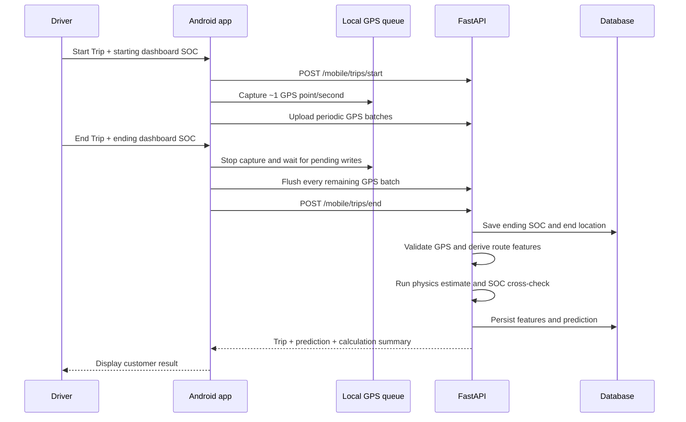

# Trickee Developer Handoff

Last updated: 2026-07-28  
Repository: <https://github.com/9059Rohith/trickee_new>  
Primary branch: `main`

## 1. Project purpose

Trickee is a GPS-first EV trip intelligence application. The Android app records
foreground GPS samples during a driver-initiated trip. The FastAPI backend
validates those samples and combines them with vehicle specifications to
estimate route energy, Wh/km, demand score, SOC consumption, and remaining
range when a recent SOC reading is available.

The current product does **not** claim to read BMS data. Starting and ending SOC
are manually entered from the vehicle dashboard. This distinction must remain
visible in the UI, API fields, and documentation.

## 2. Current status

The repository is ready for a local manager demonstration:

- React Native Android application builds successfully.
- FastAPI backend, SQLite development database, PostgreSQL deployment path, and
  Alembic migration are present.
- Start Trip requires starting dashboard SOC.
- End Trip requires ending dashboard SOC.
- The app stops GPS collection and uploads every queued point before the backend
  closes and calculates the trip.
- The result screen displays GPS distance, SOC change, calculated energy,
  Wh/km, confidence, sample count, and estimated range when available.
- Insufficient or invalid GPS is reported honestly and is never presented as a
  successful zero-distance calculation.
- Driver and fleet-manager demo accounts are seeded.
- The manager dashboard aggregates fleet trips and predictions.

Last verified locally:

- `31` backend tests passed.
- TypeScript compilation passed.
- ESLint passed with no errors.
- Docker Compose configuration validation passed.
- Android `assembleDebug` passed.

GitHub Actions is intentionally manual-only in `.github/workflows/ci.yml`.
Automatic jobs could not start because the repository owner's GitHub account
was locked for an Actions billing issue. Re-enable `push` and `pull_request`
triggers after that account issue is cleared.

## 3. Architecture

| Layer | Technology | Responsibility |
|---|---|---|
| Mobile | React Native 0.73 / TypeScript | Authentication, trip controls, foreground GPS capture, offline queue, results, manager UI |
| API | FastAPI / Pydantic | Authentication, trip lifecycle, GPS ingestion, SOC, vehicle and owner endpoints |
| Data | SQLAlchemy / Alembic | SQLite for development; PostgreSQL for deployment |
| Intelligence | Python physics pipeline | GPS filtering, route features, physics energy estimate, confidence and range |
| Deployment | Docker Compose | PostgreSQL and multi-worker API container |

Important code locations:

| Area | File |
|---|---|
| App entry | `mobile/App.tsx` |
| Mobile API URL and feature flags | `mobile/src/config/index.ts` |
| API client | `mobile/src/services/api.ts` |
| GPS capture and durable queue | `mobile/src/services/gpsTracking.ts` |
| Trip start/end UI | `mobile/src/components/DriverActionSheet.tsx` |
| SOC input | `mobile/src/components/SOCEntryModal.tsx` |
| Customer calculation result | `mobile/src/components/CalculationOverlay.tsx` |
| Live data and GPS lifecycle | `mobile/src/context/LiveDataContext.tsx` |
| Backend entry | `backend/app/main.py` |
| Trip and GPS endpoints | `backend/app/routers/mobile.py` |
| Owner summary | `backend/app/routers/fleet_owner.py` |
| GPS validation/features | `backend/app/services/gps_feature_pipeline.py` |
| Prediction orchestration | `backend/app/services/gps_prediction_service.py` |
| Physics calculation | `backend/app/services/physics_energy.py` |
| Database models | `backend/app/models/entities.py` |
| Initial migration | `backend/alembic/versions/0001_gps_first.py` |
| Demo seed | `backend/scripts/seed_demo.py` |

## 4. End-trip calculation flow



The order is important. Do not call `/mobile/trips/end` before
`stopGpsTracking()` finishes. Calculating before the queue is flushed produces
an incomplete route.

### Calculation meanings

- GPS/physics route energy is an **estimate** calculated from validated GPS
  movement and vehicle specifications.
- SOC-calibrated energy is calculated from dashboard SOC change:
  `measured_energy_wh = (starting_soc - ending_soc) / 100 * usable_kwh * 1000`.
- SOC-calibrated Wh/km is:
  `measured_energy_wh / validated_gps_distance_km`.
- Remaining range is only returned when recent SOC, usable battery capacity,
  and valid Wh/km all exist.
- A short trip and dashboard SOC rounded to whole percentages can produce noisy
  SOC-calibrated Wh/km. Keep the physics estimate and provenance visible.
- `traction_demand_proxy` and `regen_opportunity_proxy` are GPS-derived proxies,
  not throttle, motor current, or regenerated BMS energy.

## 5. Local setup

### Requirements

- Python 3.12
- Node.js 18 or 20
- JDK 17
- Android SDK and an Android emulator or device
- Docker Desktop only if testing the PostgreSQL deployment path

### Backend

PowerShell:

```powershell
cd backend
python -m venv venv
.\venv\Scripts\Activate.ps1
pip install -r requirements.txt
python -m scripts.seed_demo
python -m uvicorn app.main:app --reload --host 0.0.0.0 --port 8001
```

Health check: <http://127.0.0.1:8001/health>  
OpenAPI documentation: <http://127.0.0.1:8001/docs>

The Android emulator accesses the host at `http://10.0.2.2:8001`. That value is
configured in `mobile/src/config/index.ts`.

### Mobile

```powershell
cd mobile
npm ci
npm run android
```

Build an APK directly:

```powershell
cd mobile\android
.\gradlew.bat assembleDebug
```

Output:
`mobile/android/app/build/outputs/apk/debug/app-debug.apk`

## 6. Demo accounts

These are development-only accounts created by `python -m scripts.seed_demo`:

| Role | Email | Password |
|---|---|---|
| Driver | `driver1@evify.in` | `Driver@2026` |
| Driver | `driver2@evify.in` | `Driver@2026` |
| Fleet manager | `owner@evify.in` | `Manager@2026` |

Do not use these credentials in production.

## 7. Manager demo script

1. Start the backend on port `8001` and seed demo data.
2. Install/launch the Android debug application.
3. Sign in as `driver1@evify.in`.
4. Tap **Start Trip** and enter starting SOC, for example `80`.
5. Grant precise foreground location.
6. Move for long enough to collect multiple valid points. For a real drive,
   prefer at least 5–10 minutes so dashboard SOC resolution is meaningful.
7. Tap **End Trip**, enter ending SOC, for example `78`, and tap
   **Calculate Trip**.
8. Confirm the result displays non-zero GPS distance, GPS sample count, energy,
   Wh/km, SOC used, confidence, and range.
9. Sign in as `owner@evify.in` and confirm fleet trip, distance, energy, and
   latest vehicle prediction are updated.

## 8. Emulator test procedure

An emulator validates the software flow but does not certify physical GPS,
vehicle dashboard accuracy, or BMS hardware.

1. Launch an AVD and confirm it appears in `adb devices`.
2. Start the backend and install the debug APK.
3. Log in and start a trip with starting SOC.
4. Send realistic coordinates at intervals. Android emulator console syntax is
   longitude first, then latitude:

```powershell
adb emu geo fix 72.8311 21.1702
adb emu geo fix 72.8312 21.1703
adb emu geo fix 72.8313 21.1704
```

Use small movements and realistic timing. Large coordinate jumps are correctly
rejected by the GPS quality pipeline.

5. End the trip with a lower SOC and verify the result and database.
6. Capture failures with:

```powershell
adb logcat ReactNativeJS:V AndroidRuntime:E *:S
```

## 9. Verification commands

Run all of these before a release or manager submission:

```powershell
cd backend
.\venv\Scripts\python.exe -m pytest tests -q

cd ..\mobile
npx tsc --noEmit
npx eslint . --quiet

cd android
.\gradlew.bat assembleDebug
```

Validate deployment configuration from the repository root:

```powershell
$env:POSTGRES_PASSWORD = "local-test-only"
$env:TRICKEE_SECRET_KEY = "replace-with-a-long-local-test-secret"
docker compose config --quiet
```

Expected backend result at handoff: `31 passed`.

## 10. Main API endpoints

All application endpoints use the `/api/v1` prefix.

| Method | Endpoint | Purpose |
|---|---|---|
| `POST` | `/auth/login` | Authenticate and obtain JWT |
| `GET` | `/mobile/me` | Driver, vehicle, active trip, alerts and GPS summary |
| `POST` | `/mobile/trips/start` | Start trip and record starting SOC |
| `POST` | `/mobile/v2/trips/{trip_id}/gps-batch` | Idempotent GPS batch ingestion |
| `POST` | `/mobile/trips/end` | Record end SOC/location and calculate trip |
| `GET` | `/gps/trips/{trip_id}/prediction` | Retrieve a persisted trip prediction |
| `POST` | `/gps/trips/{trip_id}/compute` | Trigger/retrieve prediction calculation |
| `GET` | `/gps/vehicles/{vehicle_id}/summary` | Latest vehicle GPS/SOC summary |
| `POST` | `/soc/readings` | Record a valid SOC reading |
| `GET` | `/owner/summary` | Fleet-manager aggregate dashboard |
| `GET` | `/drivers/{driver_id}/trips` | Driver trip history |
| `GET` | `/health` | Deployment health check; no API prefix |

## 11. Production deployment

1. Copy `backend/.env.example` to a private deployment environment.
2. Set a strong `TRICKEE_SECRET_KEY`; never use the development default.
3. Configure the PostgreSQL `TRICKEE_DATABASE_URL`.
4. Restrict `TRICKEE_ALLOWED_ORIGINS` to approved domains.
5. Run `docker compose up --build -d` or deploy the backend Dockerfile.
6. Confirm Alembic reaches revision `0001_gps_first`.
7. Verify `/health`, authentication, GPS upload, trip calculation, and retention
   cleanup against PostgreSQL.
8. Confirm the real production API hostname. Release builds currently use
   `https://trickee-gps-first.onrender.com` from
   `mobile/src/config/index.ts`; do not ship until this domain is deployed and
   tested.
9. Provide a private release keystore through user-level Gradle properties.
   Never commit release keys or passwords.
10. Build `bundleRelease`, install the signed build, and run the complete trip
    test against production.

## 12. Known limitations and next work

### P0 — required before claiming production-ready

- Complete an emulator end-to-end trip with simulated GPS and retain screenshots
  and logs.
- Complete at least one real Android/vehicle drive with precise foreground GPS.
- Deploy and verify the production API/PostgreSQL environment.
- Confirm or replace the hard-coded Render production hostname.
- Resolve the GitHub Actions billing lock and re-enable automatic CI triggers.
- Test a signed release build, not only the debug APK.
- Run authentication, trip, GPS retention, and owner-isolation security checks
  against PostgreSQL.

### P1 — reliability and scale

- Add a true idempotent retry response for `/mobile/trips/end`. The request
  accepts an idempotency key, but completed-trip replay is not fully implemented.
- Decide whether production requires background GPS. The current policy is
  foreground-only and tracking may pause when the OS suspends the app.
- Add automated mobile tests for GPS queue concurrency, offline recovery, modal
  behavior, and result rendering.
- Test long trips that exceed several 200-point batches and temporary network
  outages.
- Test Android permission denial, location disabled, mock locations, app restart,
  token expiry, and low-memory process termination.
- Test multiple active vehicles and explicit driver-to-vehicle assignment. The
  current demo selects the first active vehicle in the driver's fleet.
- Add observability: structured logs, error reporting, metrics, request IDs, and
  deployment alerts.

### P2 — real vehicle integration

- Obtain the target vehicle/BMS protocol, SDK, OEM API, or Bluetooth
  specification.
- Add a new ingestion adapter with explicit provenance such as `bluetooth_bms`
  or `oem_api`.
- Never place fabricated voltage, current, temperature, SOC, or SOH values in
  GPS records.
- Validate timestamps, units, calibration, disconnect handling, and consent.
- Compare BMS ground truth with GPS/physics predictions before considering an ML
  residual correction model.

## 13. Release acceptance checklist

- [ ] Backend tests pass.
- [ ] TypeScript and ESLint pass.
- [ ] Android debug and signed release builds pass.
- [ ] Database migrations pass on a clean PostgreSQL database.
- [ ] Health check and login work on the deployed API.
- [ ] Starting SOC is persisted with the trip.
- [ ] GPS tracking begins only for an active trip.
- [ ] Multiple GPS batches upload without duplicates or lost points.
- [ ] Final GPS queue is empty before end-trip calculation.
- [ ] Ending SOC and final GPS location are persisted.
- [ ] Valid trips produce non-zero distance and calculation values.
- [ ] Invalid/insufficient GPS produces an honest unavailable result.
- [ ] Driver trip history shows SOC start/end, distance, and energy.
- [ ] Fleet manager sees only the correct fleet's data.
- [ ] Range is hidden when recent SOC is unavailable.
- [ ] No GPS-derived value is labeled as direct BMS telemetry.
- [ ] Offline, permission-denied, token-expired, and retry paths are tested.
- [ ] Real-device road test passes.
- [ ] Production secrets, CORS, retention, backups, and monitoring are configured.

## 14. Non-negotiable engineering rules

1. Do not fabricate BMS data.
2. Keep every prediction's confidence, source, estimated flag, and provenance.
3. Do not calculate remaining range without recent SOC.
4. Do not bypass GPS quality gates to make a demo appear successful.
5. Do not calculate the final trip before the mobile GPS queue is fully flushed.
6. Do not commit `.env`, databases, logs, virtual environments, `node_modules`,
   release keystores, or generated APK/build directories.
7. Update this document whenever the trip contract, deployment URL, hardware
   integration, or acceptance criteria change.

